# ForgeDNS Bypass

基于 **ForgeDNS + MikroTik RouterOS** 的域名策略分流方案。

本仓库用于演示如何使用 **ForgeDNS** 将特定域名的解析结果动态写入 RouterOS 的 `address-list`，再结合 RouterOS 的 `mangle + connection-mark + routing-mark + routing table` 实现基于域名的策略路由分流。

ForgeDNS 负责：**域名匹配、DNS 解析、提取 A/AAAA、同步到 RouterOS address-list**。RouterOS 负责：**连接打标、路由打标、按路由表选择出口**。

这套方案适合家庭网络、旁路由、多出口、透明代理等场景，尤其适合希望“按域名决定出口，但又不想手工维护大量 IP”的使用方式。

---

## 特性

- 基于域名的精细化策略路由
- ForgeDNS 驱动 RouterOS `address-list` 动态维护
- 支持 IPv4 / IPv6 分离维护策略集合
- 与透明代理网关配合实现分流
- 保留 RouterOS 原生连接跟踪与策略路由能力
- 熔断策略，家庭网络可用性大幅提升
- 由于缺少旁路由的全家流量接管，正常流量无限接近无旁路由模式
- 适合家庭网络、旁路由、多出口、透明代理等场景

---

## 工作原理

这套方案分成两个阶段：先由 ForgeDNS 在 DNS 阶段维护目标 IP 集合，再由 RouterOS 在转发阶段按目标 IP 执行策略路由。

1. 客户端先向 ForgeDNS 发起 DNS 查询
2. ForgeDNS 将查询转发到上游 DNS，并获取响应中的 `A / AAAA` 结果
3. ForgeDNS 判断当前域名是否命中预设策略集合
4. 若未命中，仅将解析结果正常返回给客户端，不写入 RouterOS
5. 若命中，则把解析出的目标 IP 动态写入 RouterOS 的 `address-list`
6. 客户端拿到解析结果后，继续向目标 IP 发起实际连接
7. RouterOS 在 `prerouting` 阶段检查该连接的目标地址是否命中对应的 `dst-address-list`
8. 未命中则直接走主路由表 `main`
9. 命中则先写入 `connection-mark`，再派生 `routing-mark`
10. 最终由指定的策略路由表将这部分流量转发到透明代理或其他指定出口

---

## 请求流程图

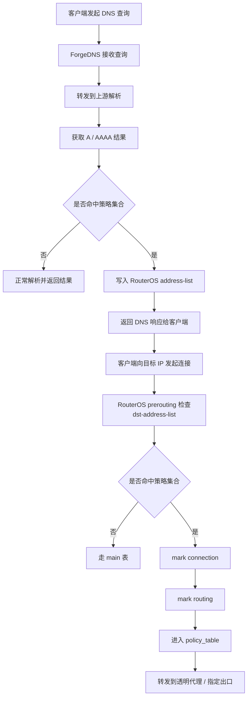

---

## RouterOS 连接决策流程

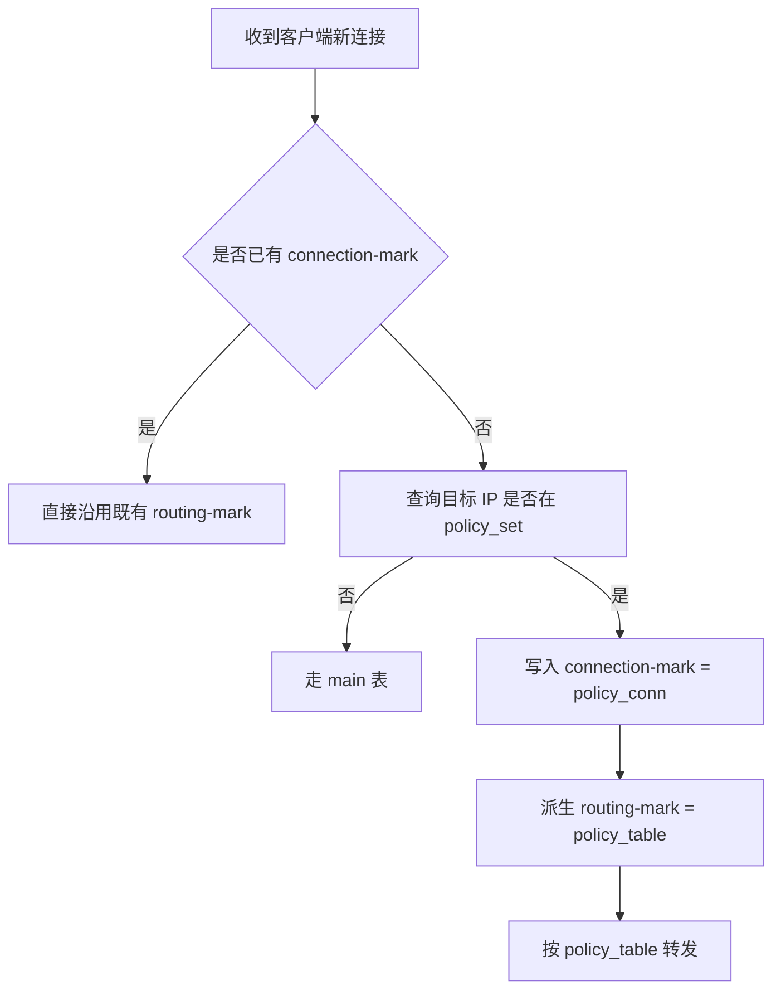

---

## 网络拓扑

下面的拓扑根据仓库原有网络拓扑图重绘，保留了原有网段和主机位置，并替换为当前的 ForgeDNS 分流方案。

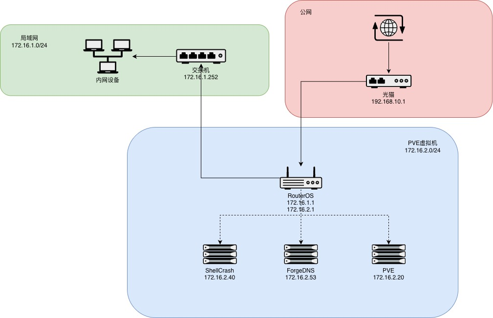

---

## 前置条件

在开始前，请确认：

1. 已经部署可正常运行的 **ForgeDNS** 
2. 客户端 DNS 已经指向 ForgeDNS
3. RouterOS 已开启 API，并允许 ForgeDNS 所在主机访问
4. 已准备好透明代理出口，例如 ShellCrash，并开启透明代理网关
5. 已规划好一个专用于策略流量的路由表，例如 `policy_table`

---

# 一、RouterOS 配置

## 1. 创建策略路由表

进入：

```text
Routing -> Tables
```

创建一个新的路由表并打开 `FIB`，例如：

- `policy_table`

这个表专门承载命中策略后的流量。

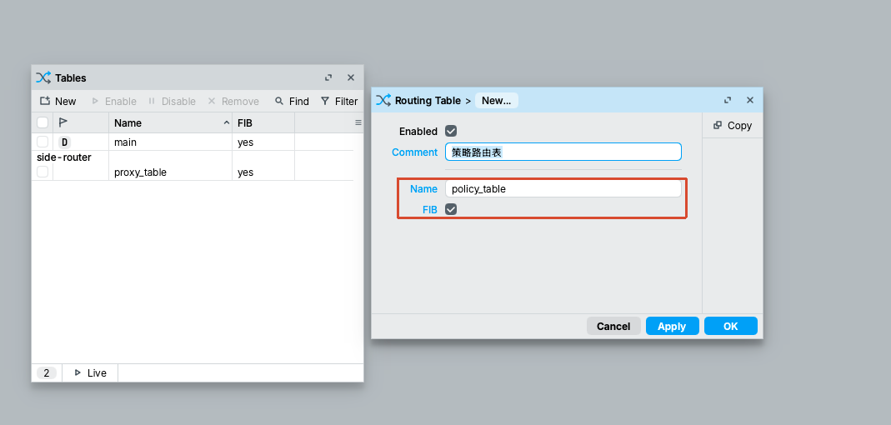

---

## 2. 为 `policy_table` 添加路由

进入：

```text
IP -> Routes
```

为 `policy_table` 增加对应的默认路由或所需静态路由。

常见方式：

- 将 `0.0.0.0/0` 指向透明代理网关
- 或者让 `policy_table` 通过某一旁路由 / 代理机转发
- 参考 `main` 路由表配置补充局域网的回程路由

例如：

- `Dst. Address`: `0.0.0.0/0`
- `Routing Table`: `policy_table`
- `Gateway`: `172.16.2.40`
- `Distance`: `2`

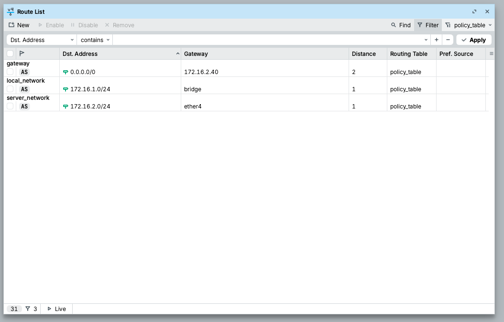

---

## 3. 规划 RouterOS address-list 名称

ForgeDNS 会把解析结果写入 RouterOS 的地址集合中。本文只以 IPv4 演示：

- `policy_set_v4`

通常不需要手工创建，但后续 ForgeDNS 和 mangle 规则都要使用相同名称。

进入：

```text
IP -> Firewall -> Address Lists
```

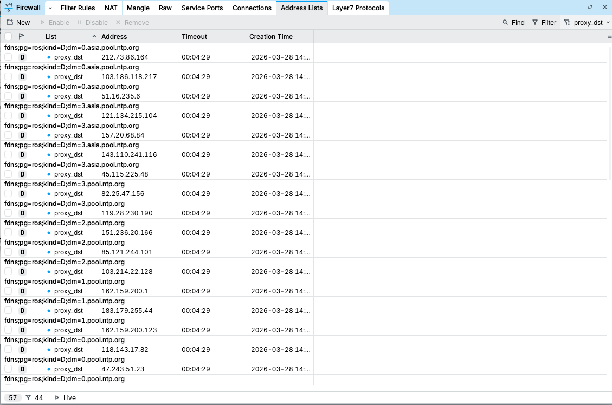

---

## 4. 可选：添加 RouterOS 局域网设置限制 address-list

如果不配置这个 `address-list`，所有经过 RouterOS 的流量都会按策略模式处理。这个列表的作用是只让指定来源网段进入策略模式。

- `policy_set_src`


进入：

```text
IP -> Firewall -> Address Lists
```

`172.16.1.64/26` 和 `172.16.1.128/26` 表示来源 IP 落在 `172.16.1.64` 到 `172.16.1.191` 区间内的主机会匹配该列表。

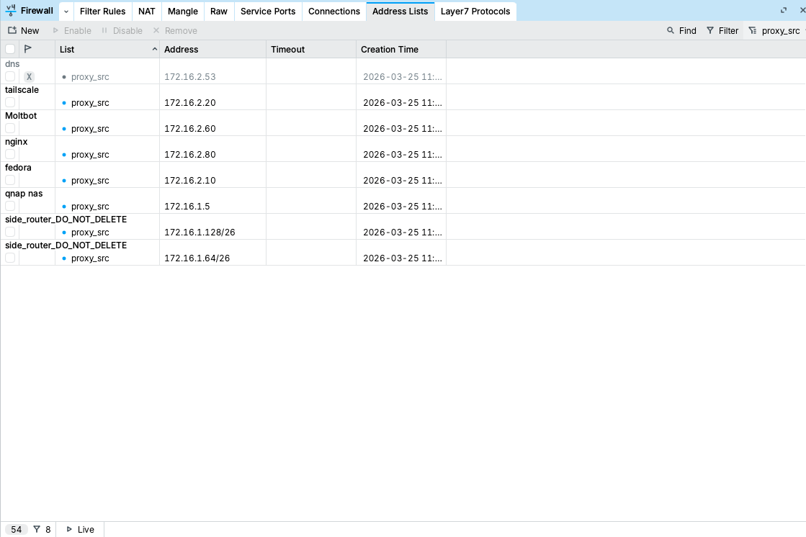

---

## 5. 配置 mangle：首包命中策略集合时打连接标记

进入：

```text
IP -> Firewall -> Mangle
```

### 规则一：根据 `dst-address-list` 写入 `connection-mark`

示例思路：

- `Chain`: `prerouting`
- `Dst. Address List`: `policy_set_v4`
- `Action`: `mark connection`
- `New Connection Mark`: `policy_conn`

IPv6 时可按同样思路单独做一套。

### 规则二：根据 `connection-mark` 写入 `routing-mark`

示例思路：

- `Chain`: `prerouting`
- `Connection Mark`: `policy_conn`
- `Action`: `mark routing`
- `New Routing Mark`: `policy_table`

这样，命中策略地址集合的连接会进入 `policy_table`。

#### `mark connection` 勾选 `passthrough`

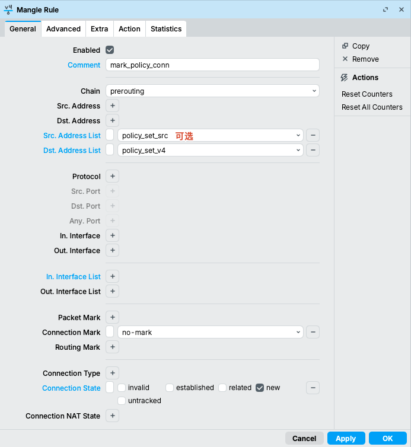
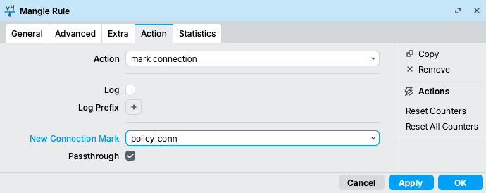

#### `mark routing` 取消勾选 `passthrough`

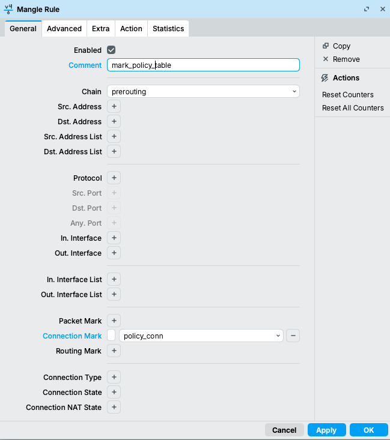
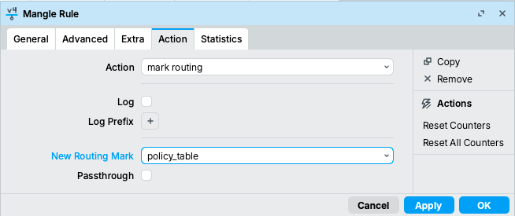

#### `output` 链中的 `mark routing` 同样取消勾选 `passthrough`

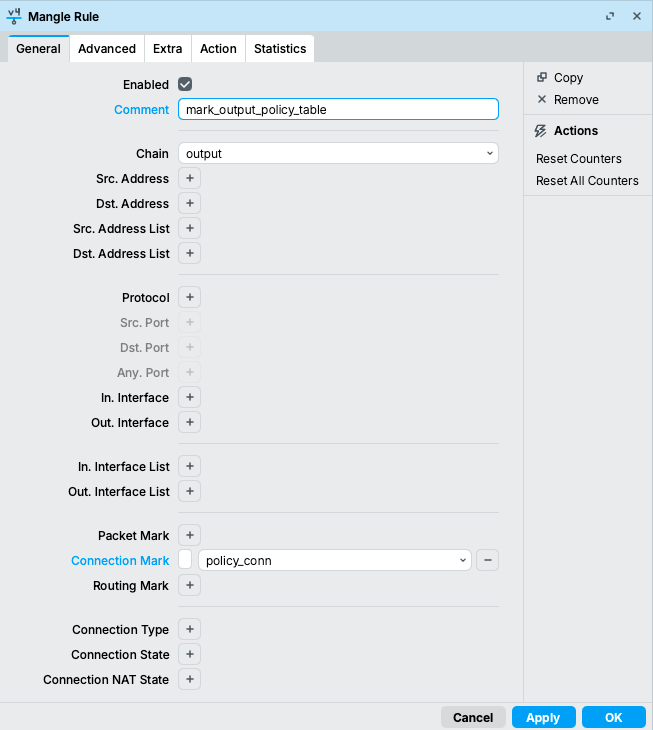

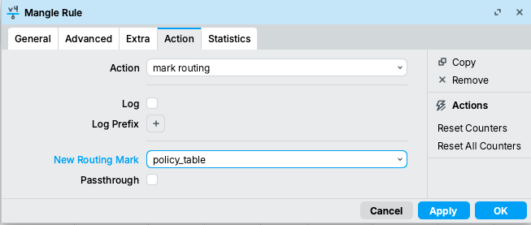
---

## 6. 配置 DNS 转发

将所有发往 RouterOS 的 DNS 请求转发到 ForgeDNS。

进入：

```text
IP -> Firewall -> NAT
```

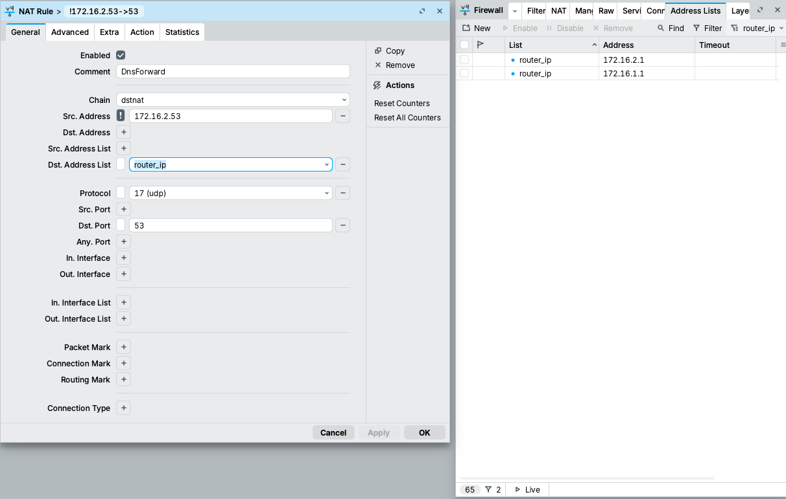
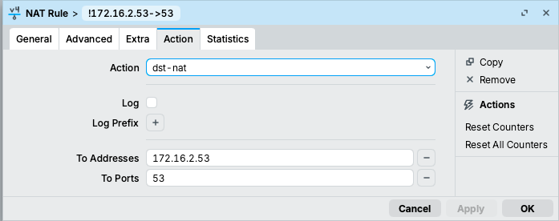

## 7. Netwatch 配置网络熔断回滚无策略模式

当 DNS 服务器或策略网关不可用时，回滚到无策略模式。

```text
Tools -> Netwatch
```

### DNS 服务器回滚

需要 DNS 服务器监听 `53` 端口。

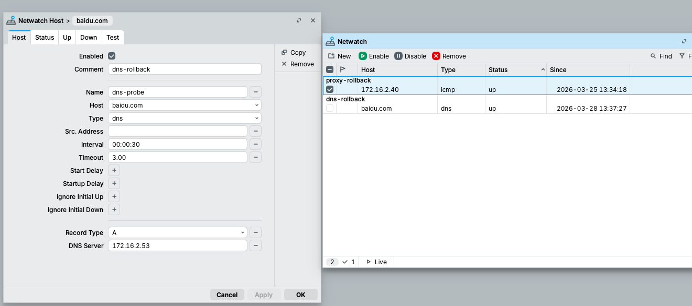

#### Up选项卡填写

```
# DNS 服务器可用时自动恢复 DNS 转发
/log info "Side-Router health probe OK - Turn ON DNS Forward";
/ip firewall nat enable [/ip firewall nat find where comment="DnsForward"];
/ip dns set allow-remote-requests=no;
```

#### Down选项卡填写
```
# DNS 服务器不可用时停止 DNS 转发
/log info "Side-Router health probe FAILED - Turn OFF DNS Forward";
/ip firewall nat disable [/ip firewall nat find where comment="DnsForward"];
/ip dns set allow-remote-requests=yes;
```

### 策略网关回滚

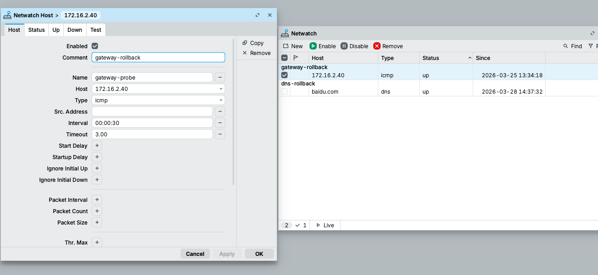

#### Up选项卡填写

```
# 策略网关可用时自动恢复策略打标
/log info "Side-Proxy health probe OK - Turn ON policy mangle";
/ip firewall mangle enable [/ip firewall mangle find where comment="mark_proxy_conn"];
```

#### Down选项卡填写
```
# 策略网关不可用时关闭策略打标
/log info "Side-Proxy health probe FAILED - Turn OFF policy mangle";
/ip firewall mangle disable [/ip firewall mangle find where comment="mark_proxy_conn"];
```
---

# 二、ForgeDNS 配置

参考仓库配置示例：[forgedns/config.yaml](forgedns/config.yaml)

ForgeDNS 文档：https://forgedns.cn

ForgeDNS 仓库：https://github.com/SvenShi/forgedns

---
# 三、验证方法

## 1. 验证 DNS 是否经过 ForgeDNS

在客户端执行：

```bash
nslookup google.com 172.16.2.53
```

或：

```bash
dig @172.16.2.53 google.com
```

确认能得到正常解析结果。

---

## 2. 验证 RouterOS address-list 是否出现动态条目

进入：

```text
IP -> Firewall -> Address Lists
```

检查：

- `policy_set_v4`
- `policy_set_v6`

中是否出现 ForgeDNS 同步的解析结果。

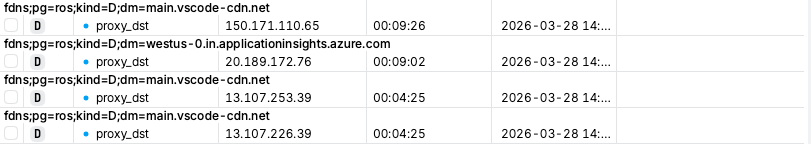

---

## 3. 验证 mangle 是否命中

进入：

```text
IP -> Firewall -> Connections
```

观察：

- `Connection Mark` 是否存在标记

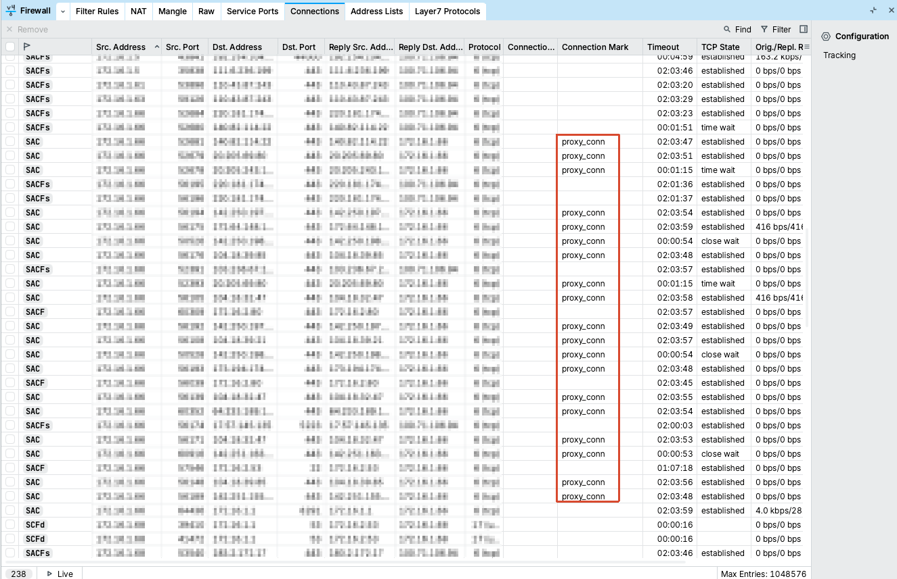

---

## 4. 验证流量是否走了代理出口

```text
IP -> Firewall -> Mangle
```

检查以下任意一项：

- `policy_table` 的流量情况
- ShellCrash 侧连接日志

---

# 四、常见问题

## 1. address-list 没有被写入

优先检查：

- 客户端是否真的在使用 ForgeDNS
- 域名是否命中了 `domain_set`
- ForgeDNS 到 RouterOS API 是否可达
- `address_list4/address_list6` 命名是否一致
- `sequence` 执行顺序是否正确

---

## 2. address-list 有数据，但流量没有走代理

优先检查：

- mangle 规则是否命中
- `connection-mark` 是否成功写入
- `routing-mark` 是否成功派生
- `policy_table` 中是否存在有效路由
- 透明代理网关是否可达

---

## 3. 命中策略后首个连接偶尔不稳定

这通常和 DNS 返回到 RouterOS `address-list` 写入之间存在极短时间窗口有关。

如果你对首包命中非常敏感，可以考虑：

- 提高 RouterOS API 通路稳定性
- 不要把 `min_ttl` 设得过低
- 对关键目标使用 `persistent`
- 在必要时评估是否关闭异步写入

---

# 参考资料

- ForgeDNS 文档: https://forgedns.cn/
- ForgeDNS 仓库: https://github.com/SvenShi/forgedns
- ForgeDNS MikroTik 策略路由: https://forgedns.cn/mikrotik-policy-routing/

---

# License

MIT
